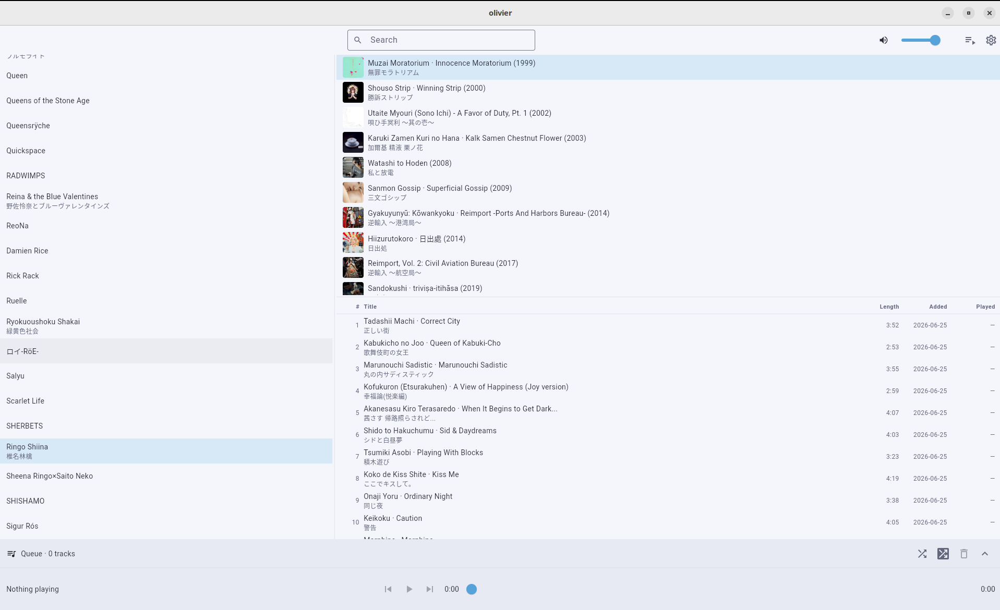
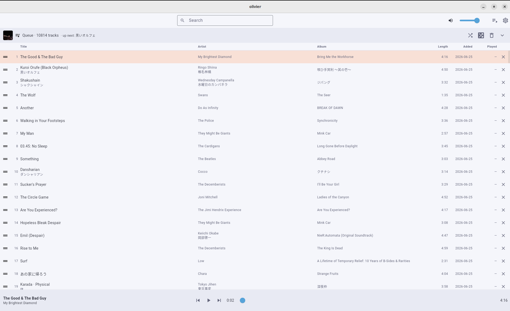

# Olivier

A music player for a local, [MusicBrainz](https://musicbrainz.org)-tagged collection, built for
**Linux desktop**. Its defining feature is **bilingual-aware display**: for music whose metadata is
in a non-Latin script (e.g. Japanese), Olivier shows the original alongside a romanized reading
and/or an English translation, so you can read, search, and sort your library either way.

Under the hood it's Flutter (UI + audio) over a Rust core via
[`flutter_rust_bridge`](https://cjycode.com/flutter_rust_bridge/): Rust owns file scanning, tag
reading ([`lofty`](https://github.com/Serial-ATA/lofty-rs)), MusicBrainz enrichment, and the SQLite
catalog; Dart drives the UI and the audio engine (`just_audio` / `media_kit` / `audio_service`).

## Screenshots

Browsing the library — artists, albums, and tracks, each shown bilingually with album art:



The expanded queue — 1-based order numbers, the now-playing row highlighted, and the transport /
seek bar along the bottom:



## Features

- **Bilingual-aware display.** Original script + romanized reading + translation for tracks, albums,
  and artists. Set a per-artist reading and sort override when MusicBrainz doesn't have one.
- **Three-pane browser.** Artists → albums → tracks in resizable panes, with album art and per-track
  length, date added, and last played.
- **MusicBrainz enrichment.** Artist/album/track metadata is fetched and cached; MBIDs are clickable
  links back to musicbrainz.org. Re-fetch a single artist or album from its right-click menu.
- **Fast search.** Incremental search matches the original, the reading, and the translation at once
  — type `shiina` or `椎名` and both find Shiina Ringo. Focus it with
  <kbd>Ctrl/Cmd</kbd>+<kbd>F</kbd>.
- **Queue.** Drag albums or tracks in, reorder, remove, and see each track's position. Expand it to
  a full-window view; a now-playing bar with a seek slider and transport controls sits along the
  bottom. "Shuffle entire library" fills the queue in random track order and plays from the top.
- **Playlists.** Persistent, named playlists with a dedicated page (create, rename, reorder, remove
  tracks) and an "Add to playlist…" entry on artist/album/track menus.
- **System integration.** Playback exposes MPRIS controls, so your desktop's media keys and
  now-playing widgets work.
- **Library management.** Scan folders, or "Check for new music" to import only files new to the
  catalog without a full rescan. Re-read on-disk tags, remove items from the library, and review an
  import decision log (de-dupe and enrichment choices) from Settings.
- **Keyboard-driven.** See the shortcuts below.

## Installing

Olivier targets Linux desktop. Each tagged release publishes packages on the
[Releases](https://github.com/houseabsolute/olivier/releases) page:

```sh
# Debian / Ubuntu
sudo apt install ./olivier_*.deb

# Fedora
sudo dnf install ./olivier-*.rpm

# Any distro — extract and run
tar xzf olivier-*-linux-x64.tar.gz && ./olivier-*-linux-x64/olivier
```

Playback needs **libmpv** at runtime (`libmpv2` on Debian/Ubuntu, `mpv-libs` on Fedora). The `.deb`
and `.rpm` declare it as a dependency; for the tarball, install it yourself.

To build from source instead, see [Development](#development).

## Usage

1. **Point it at your music.** Open **Settings** (the gear, top right) → **Add folder** and choose
   your music root. Olivier scans the folder, reads tags, and enriches the catalog from MusicBrainz.
   Later, use **Check for new music** to pick up newly-added files quickly.
2. **Browse.** Pick an artist on the left to see their albums; pick an album to see its tracks.
   Everything renders bilingually when alternate readings/translations exist.
3. **Play.** Drag a track or album into the queue, or use the right-click menu to **Play** or **Add
   to queue**. Control playback from the now-playing bar at the bottom.
4. **Search** with <kbd>Ctrl/Cmd</kbd>+<kbd>F</kbd> and type in any script.

### Keyboard shortcuts

| Shortcut                                        | Action                  |
| ----------------------------------------------- | ----------------------- |
| <kbd>Space</kbd>                                | Play / pause            |
| <kbd>Ctrl/Cmd</kbd>+<kbd>←</kbd> / <kbd>→</kbd> | Previous / next track   |
| <kbd>Ctrl/Cmd</kbd>+<kbd>↑</kbd> / <kbd>↓</kbd> | Volume down / up (±5%)  |
| <kbd>Shift</kbd>+<kbd>←</kbd> / <kbd>→</kbd>    | Seek back / forward 10s |
| <kbd>Ctrl/Cmd</kbd>+<kbd>F</kbd>                | Focus search            |
| <kbd>Ctrl</kbd>+<kbd>Q</kbd>                    | Quit                    |

(The on-screen ⏮ button restarts the current track; <kbd>Ctrl/Cmd</kbd>+<kbd>←</kbd> jumps to the
previous track. Shortcuts yield to a focused text field, so they won't fire while you're typing in
search.)

## Development

Tools are pinned in `mise.toml` (Flutter, ninja, `flutter_rust_bridge_codegen`, `nfpm`, and the
precious lint stack). Install [mise](https://mise.jdx.dev), then from the repo root:

```sh
mise install
```

Rust (via rustup) is managed outside mise. System libraries for the Linux desktop build
(Ubuntu/Debian):

```sh
sudo apt-get install -y clang cmake pkg-config libgtk-3-dev liblzma-dev \
    libstdc++-14-dev libmpv-dev
```

### Common tasks

```sh
# Run the app (Linux desktop)
just run                 # wraps: mise exec -- flutter run -d linux

# Flutter + Rust tests
mise exec -- flutter test
cd rust && cargo test

# Lint / auto-format everything (clippy, rustfmt, dart, prettier, taplo, typos, ...)
just lint --all
just tidy --all

# Build the release packages locally (.deb, .rpm, .tar.gz under dist/)
just package

# Regenerate the Dart<->Rust bindings after changing the Rust API
mise exec -- flutter_rust_bridge_codegen generate

# Regenerate the test audio fixtures (needs ffmpeg + python mutagen)
./scripts/make-fixtures.sh
```

Releases are cut by pushing a `v*` tag (e.g. `git tag v0.1.0 && git push origin v0.1.0`), which
builds the Linux bundle and publishes the `.deb`/`.rpm`/tarball to GitHub Releases. The original
design notes live under [`docs/superpowers/`](docs/superpowers/).

## License

[Apache-2.0](LICENSE).
